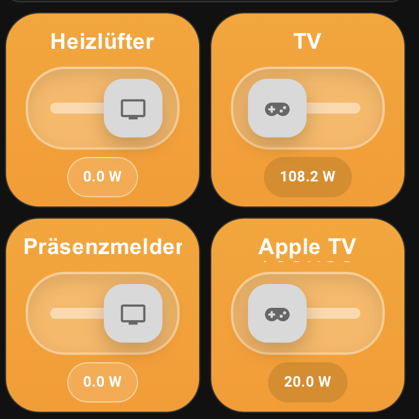

# ha-button-design

Custom Lovelace switch card for Home Assistant with an orange button-style design.

## Preview



## Card type

```yaml
type: custom:button-switch-card
```

Compatibility alias (legacy naming):

```yaml
type: custom:heat-switch-card
```

Controller alias (Dashboard picker entry):

```yaml
type: custom:ha-button-controller
```

All card types are registered for the Dashboard card picker with preview support.
The visual editor now exposes all card settings (labels, colors, thresholds, and actions), so YAML is optional.

If the card picker does not show **Button Switch Card** immediately, do a hard browser refresh and then reload Home Assistant resources.

## Installation

### HACS (recommended)

1. Add this repository as a **Custom repository** in HACS with category **Dashboard**.
2. Install **HA Button Design**.
3. Add the resource in **Settings → Dashboards → Resources**:

```yaml
url: /hacsfiles/ha-button-design/ha-button-switch-card.js
type: module
```

### Troubleshooting HACS installation

If HACS shows **Unknown error** while downloading:

1. Remove the repository from HACS.
2. Delete `/config/www/community/ha-button-design` if it was created partially.
3. Restart Home Assistant.
4. Add this repository again as a **Custom repository** with category **Dashboard**.
5. Install again.

This repository uses a minimal HACS manifest (`type`, `content_in_root`, `filename`) to avoid metadata parsing issues on stricter HACS versions.
Note: In the HACS UI the category is called **Dashboard**, but in `hacs.json` the correct backend value is still `"type": "plugin"`.

### Manual

1. Copy `ha-button-switch-card.js` into your Home Assistant `www` folder (for example `/config/www/ha-button-switch-card.js`).
2. Add the resource in **Settings → Dashboards → Resources**:

```yaml
url: /local/ha-button-switch-card.js
type: module
```

3. Reload browser cache.

## Example configuration

```yaml
type: custom:button-switch-card
name: Living Room
entity: switch.tv
icon: mdi:radiator
background_start: "#ffa20f"
background_end: "#ff9800"
on_label: "SWITCH ON"
off_label: "SWITCH OFF"
state_text_on: "Active"
state_text_off: "Idle"
track_color: "rgba(255,255,255,0.25)"
track_inner_color: "rgba(255,255,255,0.45)"
knob_color: "#d9d9d9"
chip_active_background: "rgba(216, 133, 0, 0.8)"
chip_inactive_background: "rgba(255,255,255,0.14)"
tap_action:
  action: toggle
hold_action:
  action: more-info
double_tap_action:
  action: call-service
  service: switch.turn_off
  service_data:
    entity_id: switch.living_room_lamp
```

### Compact square example (2 cards in one row)

```yaml
type: grid
columns: 2
square: false
cards:
  - type: custom:button-switch-card
    entity: switch.tv
    compact: true
    title: TV
    icon: mdi:television
    power_entity: sensor.tv_power
  - type: custom:button-switch-card
    entity: switch.console
    compact: true
    title: Console
    icon: mdi:gamepad-variant
    power_value: "85"
    power_unit: W
```

## Configuration options

| Option | Type | Default | Description |
|---|---|---|---|
| `entity` | string | **required** | Switch entity to control (`switch.*`). |
| `name` | string | entity friendly name | Title in the center of the card. |
| `title` | string | `name`/friendly name | Header title used by compact mode. |
| `icon` | string | `mdi:radiator` | Icon inside the switch knob. |
| `compact` | boolean | `false` | Enables the compact square layout for 2-up rows. |
| `power_entity` | string | empty | Sensor entity used to show the live power value at the bottom. |
| `power_value` | string/number | empty | Static fallback power value shown when no sensor is provided. |
| `power_unit` | string | `W` | Unit for `power_value` fallback or missing sensor unit. |
| `background_start` | color string | `#ffa20f` | Gradient start color. |
| `background_end` | color string | `#ff9800` | Gradient end color. |
| `on_label` | string | `SWITCH ON` | Middle bottom status text when on. |
| `off_label` | string | `SWITCH OFF` | Middle bottom status text when off. |
| `state_text_on` | string | `Active` | Right bottom label when on. |
| `state_text_off` | string | `Idle` | Right bottom label when off. |
| `track_color` | color string | `rgba(255,255,255,0.25)` | Outer switch track color. |
| `track_inner_color` | color string | `rgba(255,255,255,0.45)` | Vertical center line color. |
| `knob_color` | color string | `#d9d9d9` | Slider knob color. |
| `chip_active_background` | color string | `rgba(216, 133, 0, 0.8)` | Left chip color when switch is on. |
| `chip_inactive_background` | color string | `rgba(255,255,255,0.14)` | Chip color for inactive style. |
| `tap_action` | action config | toggle | Action on click / Enter / Space. |
| `hold_action` | action config | more-info | Action on right click (context menu). |
| `double_tap_action` | action config | toggle | Action on double click. |

## Supported actions

- `toggle`
- `more-info`
- `call-service`

When no action is provided, the card toggles the configured entity.

## Notes

- The card is optimized for a portrait tile style (similar to your screenshot).
- The card uses only native Home Assistant frontend primitives.
- All comments in source code are in English.

## Related project

If you like this design, check out my matching climate/heating dashboard project:

- **HA Heat Design**: https://github.com/404GamerNotFound/ha-heat-design

## Support

If you want to support my work, you can donate here:

- **PayPal**: https://www.paypal.com/paypalme/TonyBrueser
